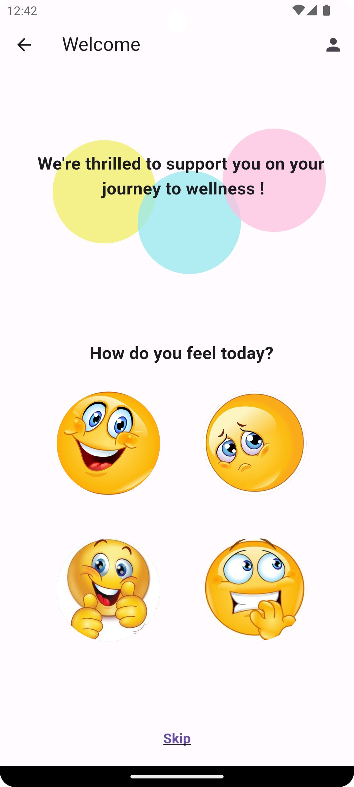
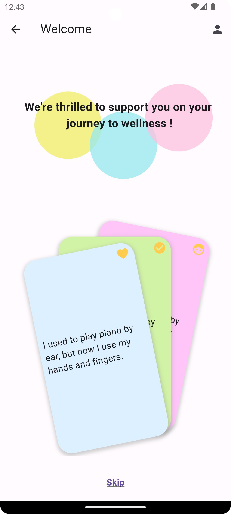
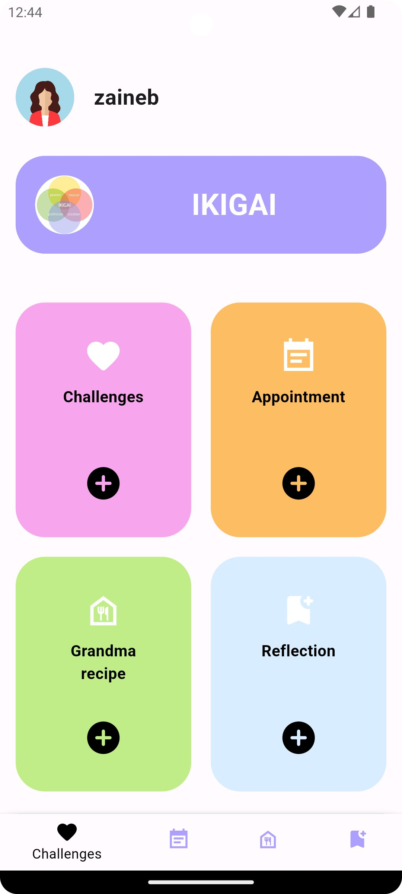
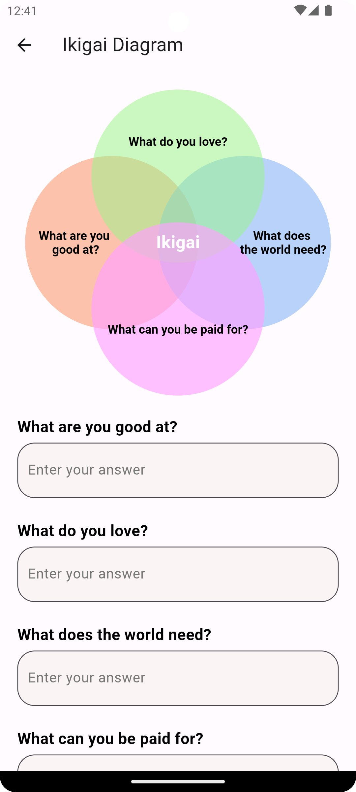
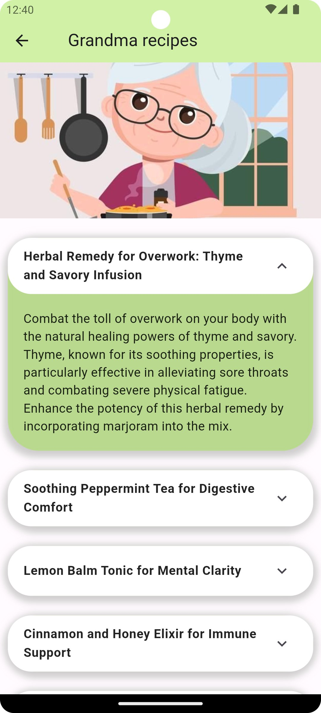

# Project Name

**MYND**

## Team Members

- Zaineb Benamar
- Anis Amor
- Hamouda Mtir
- Mohamed Halim Elleuch

## About the App

MYND is a mobile application designed to empower users on their journey to better mental health. With features such as mood-boosting content, Ikigai-based challenges, grandma recipes and a reflective journal, the app provides a holistic approach to mental well-being.

## Tagline

"Your daily dose of joy!"

## Screenshots

    

## Permissions Required

The app requires the following permissions:
- Internet Access
- Calendar Access (for challenge follow up)

## Data Safety Information

Your privacy and data security are our top priorities. We ensure:
- **Anonymity:** Personal data is anonymized for insights and trends.
- **Secure Storage:** User data is securely stored, adhering to industry standards.
- **No Third-Party Sales:** We do not sell your data to third parties.
- **Opt-Out Option:** Users have the option to opt-out of data sharing for research.

